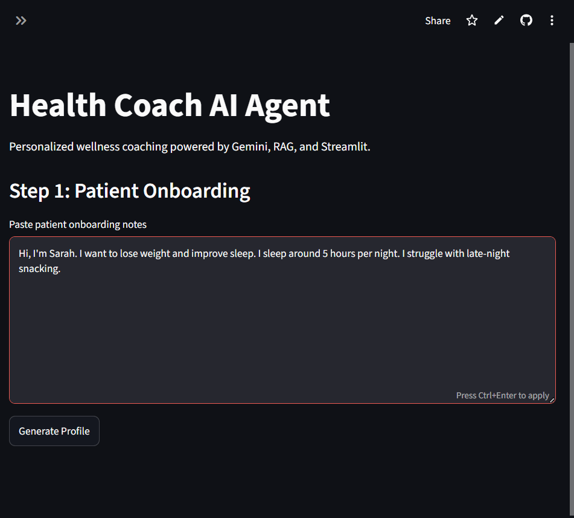
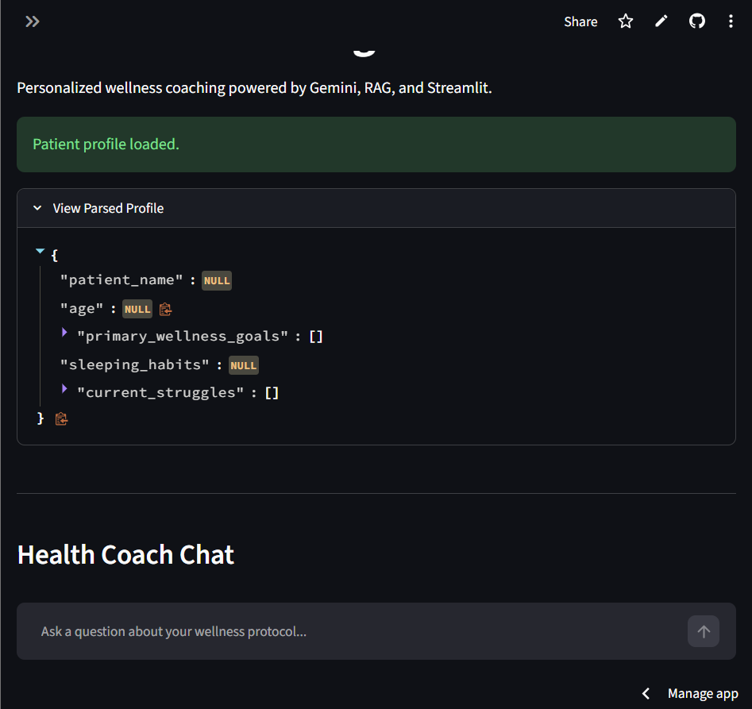
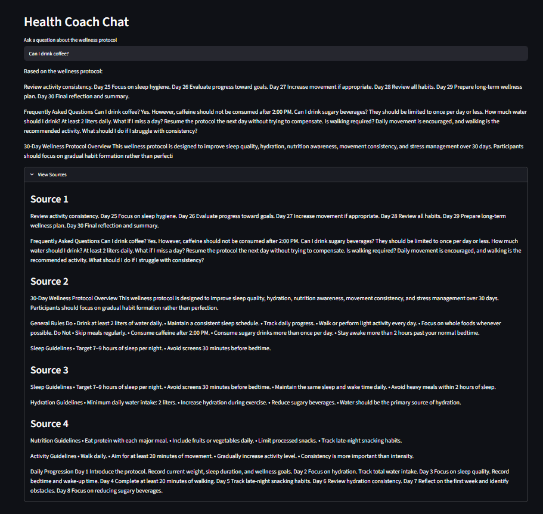
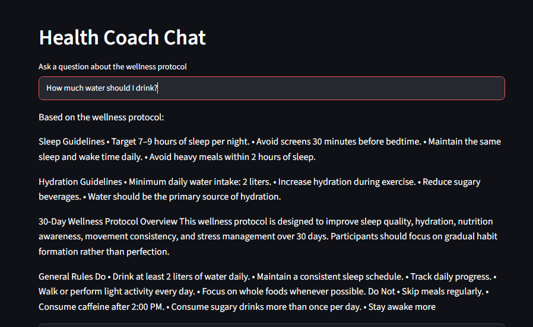

# 🏥 Health Coach AI Agent

<div align="center">


**An intelligent, RAG-powered wellness coaching agent that transforms unstructured patient notes into structured profiles and delivers grounded, personalized health guidance.**

[Features](#-features) • [Architecture](#-architecture) • [Installation](#-installation) • [Usage](#-running-the-application) • [Design Decisions](#-key-engineering-decisions)

</div>

---

## 🌐 Live Demo

| | Link |
|--|------|
| 🚀 **Streamlit App** | _[https://health-coach-agent-dg8of9gu4cyrpxqm8ethrs.streamlit.app/]_ |
| 🎥 **Demo Video** | _[Add YouTube / Loom walkthrough link here]_ |

---

## 📋 Project Overview

> This project was developed as part of an AI Engineering internship assignment to demonstrate skills in LLM application development, Retrieval-Augmented Generation (RAG), structured data extraction, prompt engineering, and modular software architecture.

**Health Coach AI Agent** is a modular AI application that addresses a real-world wellness coaching challenge: converting messy, unstructured patient onboarding notes into actionable, structured profiles — then leveraging those profiles to deliver personalized wellness coaching that is strictly grounded in verified protocol documentation.

The agent combines **Gemini structured output extraction**, **Retrieval-Augmented Generation (RAG)** over a wellness protocol PDF, and **session-aware memory** to simulate an intelligent, adaptive health coach. Unlike general-purpose LLM chatbots, this system is explicitly designed to refuse out-of-scope responses, minimizing hallucination risk and making it suitable for health-adjacent applications.

---

## 💡 Motivation

Modern health applications face two critical problems:

1. **Unstructured intake data** — Patient onboarding notes are often freeform, inconsistent, and difficult to process programmatically. Manually parsing these notes is time-consuming and error-prone.

2. **Hallucination risk in health AI** — General-purpose LLMs can confidently provide medically inaccurate information. In health contexts, this is not just unhelpful — it can be harmful.

This project was designed to solve both problems:

- **Structured Extraction Pipeline:** Using Gemini's structured output capabilities with Pydantic schema validation to reliably convert freeform text into typed, validated patient profiles.
- **Document-Grounded Responses:** All coaching responses are retrieved from and grounded in a specific wellness protocol PDF, making the agent's knowledge boundary explicit and auditable.

The architecture reflects a deliberate engineering philosophy: **controlled, transparent AI** over unconstrained generative capability.

---

## ✨ Features

| # | Feature | Description |
|---|---------|-------------|
| 1 | **Structured Profile Extraction** | Converts unstructured onboarding notes into validated patient profiles using Gemini structured output |
| 2 | **Pydantic Schema Validation** | Enforces strict type safety and field validation on all extracted patient data |
| 3 | **PDF-Based RAG** | Retrieves relevant context exclusively from a wellness protocol PDF before generating any response |
| 4 | **FAISS Vector Search** | Efficient semantic similarity search over embedded document chunks |
| 5 | **Session Memory** | Maintains multi-turn conversation history using Streamlit Session State |
| 6 | **Day-Aware Coaching** | Adapts responses based on the patient's current protocol day for contextually relevant guidance |
| 7 | **Hallucination Prevention** | Refuses to answer questions outside the retrieved document context with an explicit refusal message |
| 8 | **Source Transparency** | Displays retrieved document chunks in the UI so users can verify the source of every response |
| 9 | **Interactive Chat Interface** | Clean, intuitive Streamlit chat UI with multi-turn conversation support |

---

## 🏗️ Architecture

### System Architecture Diagram

```
┌─────────────────────────────────────────────────────────────────────┐
│                        HEALTH COACH AI AGENT                        │
└─────────────────────────────────────────────────────────────────────┘

  ┌──────────────────────────────────────────────────────────────┐
  │                     USER INPUT LAYER                         │
  │   Unstructured onboarding text  │  Chat query               │
  └──────────────────┬──────────────────────────────┬───────────┘
                     │                              │
                     ▼                              ▼
  ┌──────────────────────────┐    ┌─────────────────────────────┐
  │   PROFILE EXTRACTION     │    │      SESSION MEMORY         │
  │  parser/profile_parser.py│    │   Streamlit Session State   │
  │                          │    │   (Multi-turn history)      │
  │  Gemini Structured Output│    └──────────────┬──────────────┘
  │  + Pydantic Validation   │                   │
  └──────────────┬───────────┘                   │
                 │                               │
                 ▼                               │
  ┌──────────────────────────┐                   │
  │     PATIENT STATE        │                   │
  │  ├── Name                │                   │
  │  ├── Age                 │                   │
  │  ├── Wellness Goals      │◄──────────────────┘
  │  ├── Sleeping Habits     │
  │  └── Current Struggles   │
  └──────────────┬───────────┘
                 │
                 ▼
  ┌──────────────────────────────────────────────────────────────┐
  │                     RAG PIPELINE                             │
  │                                                              │
  │   ┌─────────────────┐       ┌──────────────────────────┐    │
  │   │  protocol.pdf   │──────►│  Document Chunking       │    │
  │   │  (data/)        │       │  (LangChain TextSplitter) │   │
  │   └─────────────────┘       └──────────────┬───────────┘    │
  │                                            │               │
  │                                            ▼               │
  │                              ┌──────────────────────────┐  │
  │                              │   Gemini Embeddings      │  │
  │                              │   (text-embedding model) │  │
  │                              └──────────────┬───────────┘  │
  │                                            │               │
  │                                            ▼               │
  │                              ┌──────────────────────────┐  │
  │                              │   FAISS Vector Database  │  │
  │                              │   (rag/retriever.py)     │  │
  │                              └──────────────┬───────────┘  │
  │                                            │               │
  │                                            ▼               │
  │                              ┌──────────────────────────┐  │
  │                              │   Similarity Search      │  │
  │                              │   Top-K Relevant Chunks  │  │
  │                              └──────────────┬───────────┘  │
  └───────────────────────────────────────────┬┴───────────────┘
                                              │
                                              ▼
  ┌──────────────────────────────────────────────────────────────┐
  │                   HEALTH COACH AGENT                         │
  │                  agents/health_agent.py                      │
  │                                                              │
  │   Inputs:                                                    │
  │   ├── Patient Profile (structured)                           │
  │   ├── Session Memory (conversation history)                  │
  │   ├── Current Protocol Day                                   │
  │   └── Retrieved RAG Context (top-K chunks)                  │
  │                                                              │
  │   System Prompt: prompts/system_prompt.py                    │
  │   → Grounds agent to retrieved context only                  │
  │   → Instructs refusal if outside context                     │
  └──────────────────────────────────────────┬──────────────────┘
                                             │
                                             ▼
  ┌──────────────────────────────────────────────────────────────┐
  │                  GEMINI 2.5 FLASH                            │
  │            (Response Generation)                             │
  └──────────────────────────────────────────┬──────────────────┘
                                             │
                                             ▼
  ┌──────────────────────────────────────────────────────────────┐
  │                  STREAMLIT INTERFACE                         │
  │                      app.py                                  │
  │                                                              │
  │   ├── Chat response display                                  │
  │   ├── Source chunk transparency panel                        │
  │   └── Patient profile summary sidebar                        │
  └──────────────────────────────────────────────────────────────┘
```

### Data Flow Summary

```
Onboarding Text → [Gemini Extract] → Pydantic Model → Patient State
User Query      → [FAISS Search]  → RAG Context    → Agent Prompt
Agent Prompt    → [Gemini Flash]  → Response       → Streamlit UI
```

---

## 📁 Folder Structure

```
health_coach_agent/
│
├── app.py                  # Main Streamlit application entry point
├── requirements.txt        # Python dependencies
├── README.md               # Project documentation
│
├── data/
│   └── protocol.pdf        # Wellness protocol document (RAG source)
│
├── parser/
│   └── profile_parser.py   # Gemini structured output + Pydantic extraction
│
├── rag/
│   └── retriever.py        # FAISS index builder and similarity retriever
│
├── agents/
│   └── health_agent.py     # Core agent logic, prompt assembly, Gemini call
│
├── prompts/
│   └── system_prompt.py    # System prompt templates with grounding instructions
│
├── utils/
│   └── config.py           # Environment config, constants, model settings
│
├── screenshots/            # UI screenshots for README documentation
│   ├── onboarding.png      # Patient onboarding input screen
│   ├── profile_parser.png  # Extracted structured patient profile
│   ├── rag_chat.png        # RAG-grounded coaching response
│   └── source_view.png     # Retrieved source chunk transparency panel
│
└── report/
    └── technical_report.md # Technical design report for internship evaluation
```

---

## 🛠️ Technology Stack

| Layer | Technology | Purpose |
|-------|-----------|---------|
| **Frontend** | Streamlit | Interactive chat UI and session state management |
| **LLM** | Gemini 2.5 Flash | Response generation and structured data extraction |
| **Embeddings** | Gemini Embedding Model | Semantic vectorization of document chunks |
| **Orchestration** | LangChain | Document loading, text splitting, chain composition |
| **Vector Store** | FAISS | Efficient k-nearest-neighbor semantic search |
| **Data Validation** | Pydantic v2 | Schema definition and runtime validation for patient profiles |
| **PDF Processing** | PyPDF | Extracting text content from the wellness protocol PDF |
| **Configuration** | python-dotenv | Secure API key and environment variable management |
| **Language** | Python 3.12 | Core runtime |

---

## 🚀 Installation

### Prerequisites

- Python 3.12+
- A Google AI Studio API key ([Get one here](https://aistudio.google.com/apikey))
- Git

### Step-by-Step Setup

**1. Clone the repository**

```bash
git clone https://github.com/your-username/health-coach-agent.git
cd health-coach-agent
```

**2. Create and activate a virtual environment**

```bash
# Create virtual environment
python -m venv venv

# Activate — macOS/Linux
source venv/bin/activate

# Activate — Windows
venv\Scripts\activate
```

**3. Install dependencies**

```bash
pip install -r requirements.txt
```

**4. Add your wellness protocol PDF**

Place your wellness protocol PDF at:

```
data/protocol.pdf
```

> The RAG pipeline is built on first run and cached. Ensure this file is present before launching the app.

---

## 🔑 Environment Variables Setup

Create a `.env` file in the project root:

```bash
touch .env
```

Add the following variables:

```env
# Google Gemini API Key (required)
GOOGLE_API_KEY=your_google_api_key_here

# Optional: Override default model names
GEMINI_MODEL=gemini-2.5-flash
GEMINI_EMBEDDING_MODEL=models/gemini-embedding-001

# Optional: RAG configuration
CHUNK_SIZE=1000
CHUNK_OVERLAP=200
TOP_K_RESULTS=4
```

> ⚠️ **Security:** Never commit your `.env` file. It is already listed in `.gitignore`.

---

## ▶️ Running the Application

```bash
streamlit run app.py
```

The application will open at `http://localhost:8501` in your default browser.

### First-Time Initialization

On the first run, the app will:
1. Load and chunk `data/protocol.pdf`
2. Generate embeddings via the Gemini Embedding API
3. Build and cache the FAISS index
4. Present the onboarding input screen

Subsequent runs will use the cached FAISS index for faster startup.

---

## 🔄 Example Workflow

### Step 1 — Patient Onboarding

Paste unstructured patient notes into the onboarding field:

```
"John is 34 years old. He wants to lose weight and improve his energy levels.
He sleeps around 5 hours a night and struggles with late-night snacking 
and staying consistent with his exercise routine. Starting Day 1 of the 
30-day wellness plan."
```

### Step 2 — Structured Profile Extraction

The system uses Gemini structured output + Pydantic validation to produce:

```json
{
  "patient_name": "John",
  "age": 34,
  "primary_wellness_goals": [
    "lose weight",
    "improve energy"
  ],
  "sleeping_habits": "sleeps around 5 hours a night",
  "current_struggles": [
    "late-night snacking",
    "staying consistent with exercise"
  ]
}
```

### Step 3 — Personalized Coaching Interaction

```
User: What should I focus on during Day 1 for better sleep?

Agent: Based on the wellness protocol for Day 1, the recommended starting 
point for improving sleep quality is establishing a consistent wind-down 
routine 30 minutes before bed. Given that you're currently sleeping around 
5 hours and struggling with late-night snacking, the protocol suggests 
setting a kitchen cut-off time in the evening to reduce stimulation before sleep...

📄 Source: Protocol PDF — Sleep & Recovery, Day 1 Guidelines
```

```
User: What stocks should I invest in for passive income?

Agent: I cannot find that information in the wellness protocol. I'm only 
able to assist with questions related to your health coaching plan.
```

---

## 🛡️ Hallucination Prevention Strategy

Hallucination risk in health-adjacent AI is a first-class concern. This system uses a deliberate, layered approach to keep responses grounded and auditable:

**1. Retrieval-First Architecture**
Every response is generated only after retrieving the most semantically relevant chunks from `protocol.pdf`. The model is never asked to "know" health facts — it is asked to reason over what has been retrieved.

**2. Context-Constrained System Prompt**
The system prompt in `prompts/system_prompt.py` explicitly instructs the agent to:
- Answer only from the retrieved document context passed into the prompt.
- Prefix grounded responses with "Based on the wellness protocol..." to make sourcing explicit.
- Refuse any question where the retrieved context does not contain a relevant answer.

**3. Explicit Refusal Behaviour**
When a question cannot be answered from the retrieved context, the agent responds with a clear, consistent refusal:

> *"I cannot find that information in the wellness protocol."*

The agent does not fall back to parametric memory or attempt to answer from general knowledge. This is enforced through prompt instruction rather than similarity score thresholds, keeping the behaviour transparent and easy to audit.

**4. Source Transparency**
The UI exposes the exact retrieved chunks that informed each response. Users and evaluators can verify that every answer is traceable back to the source document, enabling direct human oversight.

**5. Pydantic Validation at Extraction**
The patient profile extraction layer validates all fields at runtime. Invalid or missing fields trigger graceful fallback rather than silent failures that could propagate incorrect data downstream.

---

## ⚙️ Key Engineering Decisions

### Why FAISS?

The knowledge base is a single wellness protocol PDF. A hosted vector database (Pinecone, Weaviate, ChromaDB) would introduce external infrastructure, network latency, and API cost for no meaningful benefit at this scale. FAISS runs entirely in-process, rebuilds in seconds, and requires zero external dependencies — the right tool for a single-document RAG system.

**Tradeoff:** FAISS does not scale horizontally and the index must be rebuilt if the document changes. This is an acceptable constraint for this use case.

---

### Why Gemini?

Gemini was chosen for three compounding reasons: native structured output support with schema binding (eliminating JSON parsing fragility), an embedding model available within the same ecosystem (reducing integration surface area), and a unified API that handles both extraction and generation — simplifying the codebase significantly.

**Tradeoff:** Tighter coupling to Google's API surface. The architecture could be adapted to other providers, but the Pydantic schema binding is currently Gemini-specific.

---

### Why Streamlit?

For an MVP-stage internship project, Streamlit provides the fastest path from working backend logic to a usable, demonstrable UI. Its built-in `st.session_state` maps naturally onto the conversation memory model, and deployment to Streamlit Community Cloud requires zero additional configuration.

**Tradeoff:** Session memory does not persist across page refreshes. This is a known limitation noted in Future Improvements.

---

## 🧠 Design Decisions and Tradeoffs

### Decision 1: Gemini Structured Output over Prompt-Parsed JSON

**Chosen:** Gemini's native structured output API with Pydantic schema binding.

**Alternative considered:** Prompt engineering the model to return JSON, then parsing the string.

**Rationale:** Native structured output eliminates JSON parsing errors, markdown-wrapped code blocks, and schema drift. The Pydantic integration provides runtime type validation, making the extraction pipeline robust to varied input formatting. The tradeoff is tighter coupling to the Gemini API, but the reliability gains justify this in a health data context.

---

### Decision 2: FAISS over Hosted Vector Database (Pinecone, Weaviate)

**Chosen:** FAISS (in-process vector store).

**Alternative considered:** Pinecone or Weaviate for scalable vector search.

**Rationale:** For a single-document RAG system (one wellness protocol PDF), a hosted vector database introduces unnecessary infrastructure complexity, latency, and cost. FAISS provides fast, accurate similarity search in-process with zero external dependencies. The tradeoff is that FAISS does not scale horizontally and requires the index to be rebuilt if the document changes — acceptable for this use case.

---

### Decision 3: Streamlit Session State for Memory

**Chosen:** `st.session_state` for conversation history.

**Alternative considered:** LangChain `ConversationBufferMemory` or an external Redis store.

**Rationale:** Streamlit's session state is tightly integrated with the UI lifecycle, making it the simplest and most maintainable choice for a single-user chat application. It avoids introducing a memory management dependency. The primary tradeoff is that memory does not persist across browser refreshes — acceptable for a demo and internship context, but a known limitation for production.

---

### Decision 4: Prompt-Based Refusal over Similarity Thresholding

**Chosen:** Explicit refusal for out-of-scope queries enforced via system prompt instructions.

**Alternative considered:** Embedding similarity threshold to auto-filter low-relevance queries before they reach the LLM.

**Rationale:** Similarity thresholds require careful calibration and can produce false negatives (blocking valid queries) or false positives (allowing hallucination-prone queries through). A prompt-based refusal strategy is more interpretable and auditable — behaviour can be inspected, adjusted, and explained without tuning a numeric hyperparameter. Future versions could combine both approaches as a defence-in-depth strategy.

---

## 🔮 Future Improvements

- [ ] **Persistent memory** — Store conversation history and patient profiles in a SQLite or PostgreSQL database across sessions.
- [ ] **Multi-document RAG** — Extend the retriever to support multiple protocol PDFs and dynamically select the most relevant source.
- [ ] **Similarity threshold filtering** — Add a configurable relevance threshold to the FAISS retriever for automatic out-of-scope detection before the LLM call.
- [ ] **Authentication layer** — Add user login so multiple patients can maintain separate profiles and histories.
- [ ] **Profile editing UI** — Allow patients to review and edit their extracted profile before beginning coaching.
- [ ] **Automated RAG evaluation** — Implement RAG evaluation metrics (faithfulness, answer relevance, context precision) using RAGAS or a custom harness.
- [ ] **LangSmith tracing and observability** — Integrate LangSmith to trace every retrieval and generation call for debugging and evaluation.
- [ ] **Conversation summarization memory** — Replace raw history buffering with LLM-generated summaries to support longer sessions without context overflow.
- [ ] **Streaming responses** — Enable token-by-token streaming from the Gemini API for a more responsive chat experience.
- [ ] **Admin dashboard** — Add a sidebar view for reviewing all retrieved chunks, latency metrics, and token usage per session.
- [ ] **Query parameter support** — Allow protocol day and patient name to be passed via URL query parameters for easier reviewer testing.
- [ ] **Protocol day auto-tracking** — Automatically increment the protocol day based on session timestamps.
- [ ] **Docker containerization** — Package the application in a Docker image for reproducible deployment.

---

## ⚠️ Known Limitations

- **Session-scoped memory** — Conversation history and patient profiles are stored in Streamlit session state only. Refreshing the browser clears all data.
- **Single-document knowledge** — The agent's knowledge is strictly limited to the provided `protocol.pdf`. It cannot answer questions outside this document.
- **Chunking-dependent retrieval quality** — RAG retrieval accuracy is sensitive to how the PDF is chunked. Poorly structured PDFs or overly large chunks may reduce response relevance.
- **Not for medical use** — This system is designed for wellness coaching guidance only and must not be used for medical diagnosis, clinical decision-making, or as a substitute for professional healthcare advice.

---

## 🧪 Evaluation Approach

The application was manually tested across the following dimensions before submission:

| Dimension | What Was Tested |
|-----------|----------------|
| **Structured extraction accuracy** | Varied onboarding note formats, missing fields, ambiguous phrasing |
| **RAG grounding quality** | Protocol-related queries at different days; verified responses cite only retrieved content |
| **Out-of-scope query handling** | Non-wellness questions (finance, politics, general knowledge) — confirmed refusal behaviour |
| **Session memory continuity** | Multi-turn conversations referencing earlier messages — confirmed context retention within session |
| **Day-aware coaching behaviour** | Queries explicitly referencing Day 1, Day 7, Day 14 — verified protocol-day context injection |

Formal automated evaluation using frameworks such as RAGAS is listed as a future improvement.

---

## 📸 Screenshots

### Patient Onboarding

Shows the onboarding interface where patient notes are entered before profile extraction.



---

### Structured Profile Extraction

Demonstrates the conversion of unstructured onboarding notes into a structured patient profile.



---

### RAG-Powered Health Coaching

Example of a protocol-grounded response generated using document retrieval.



---

### Protocol Question Response

Demonstrates answering wellness questions using information retrieved from the protocol document.


---

## 🎥 Demo Video

> **Note:** A walkthrough demo video will be uploaded before the final submission deadline.

**Planned demo coverage:**
- [ ] Pasting unstructured patient notes and triggering extraction
- [ ] Reviewing the validated structured patient profile
- [ ] Asking protocol-grounded questions and seeing source chunks
- [ ] Demonstrating the refusal behavior on out-of-scope queries

📺 **Demo Link:** _[To be added]_

---

## 📄 License

This project is developed as part of an internship assignment and is intended for educational and evaluation purposes.

```
MIT License

Copyright (c) 2025 [Bhanu Pratap]

Permission is hereby granted, free of charge, to any person obtaining a copy
of this software and associated documentation files (the "Software"), to deal
in the Software without restriction, including without limitation the rights
to use, copy, modify, merge, publish, distribute, sublicense, and/or sell
copies of the Software, and to permit persons to whom the Software is
furnished to do so, subject to the following conditions:

The above copyright notice and this permission notice shall be included in all
copies or substantial portions of the Software.

THE SOFTWARE IS PROVIDED "AS IS", WITHOUT WARRANTY OF ANY KIND, EXPRESS OR
IMPLIED, INCLUDING BUT NOT LIMITED TO THE WARRANTIES OF MERCHANTABILITY,
FITNESS FOR A PARTICULAR PURPOSE AND NONINFRINGEMENT.
```

---

<div align="center">

**Built as part of an AI Engineering Internship Assessment**

*Demonstrating applied skills in LLM application development, RAG systems, structured data extraction, and modular AI application architecture.*

</div>
